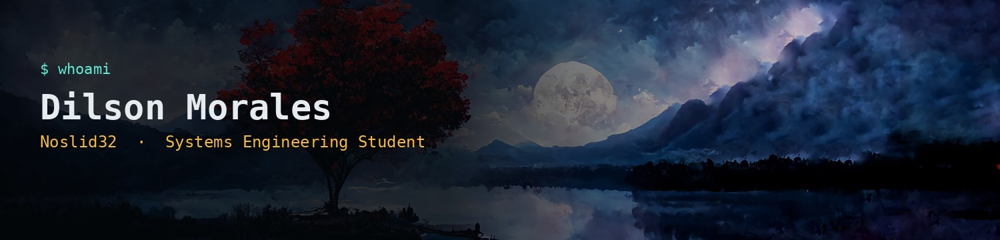

### Hola, soy Dilson 👋 `Noslid32`

```
> whoami
Dilson Koka'ib' Morales Tajiboy
> class
Guatemala 🇬🇹
```

🔗 [Noslid32 — Portafolio](https://personal-portfolio-six-mu-12.vercel.app/#contact)

- 🎓 Ingeniería en Sistemas — 3er año, Universidad Galileo
- 🕹️ Cuando no estoy compilando código, estoy grindeando en algún juego
- 🌱 Aprendiendo: **Java** y **Python**
- 🧩 Me interesa: desarrollo de software, bases de datos y resolver problemas como quien limpia un mapa
- 🗣️ Idiomas: Español, Inglés (básico), Maya K'iche' (comprensión)
- 📫 Contáctame: dilson.morales@galileo.edu
- 💼 LinkedIn: [dilson-koka-ib-morales-tajiboy](https://www.linkedin.com/in/dilson-koka-ib-morales-tajiboy-010723349/)

---

**Stack actual**


---

> "Nivel actual: Junior Dev. Siguiente boss: primer proyecto en producción." 🎮
